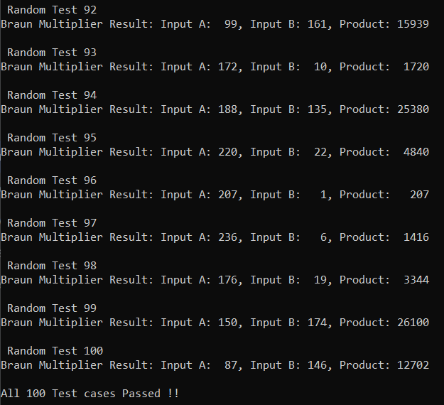

# 16-Bit Braun Multiplier (In Progress)

This projects designs and verifies a 16-Bit Braun Multiplier, it is used for unsigned multiplication and consists of a simple parallel multiplier structure. Due to its straightforward design it is widely used in hardware designs.

## Description

### DUT: 16-Bit Braun Multiplier

A Braun multiplier for multiplying an n-bit multiplicand (B) by an m-bit multiplier (A) typically consists of the following components arranged in a specific pattern:

- Partial Product Generation: For each bit in the multiplier (A), a partial product is generated by performing a bitwise AND operation between that multiplier bit and the entire multiplicand (B). If the j-th bit of the multiplier (A<sub>j</sub>) is '1', the partial product is equal to the multiplicand (B) shifted left by j positions. If A<sub>j</sub> is '0', the partial product is all zeros.

- Partial Product Accumulation: The generated partial products are then added together to produce the final product. This addition is typically done using an array of full adders.

### Requirements

A 16 Bit Braun Multiplier would require the following components:
1. ` n x n ` multiplier would require `n(n-1)` full adders, => for a 16 bit output we need 8 bit operands, => `8 x (8-1) = 56` Full Adders are required.
2. Partial product generation requires AND gates, and we will have `8 x 8` partial products => 64 AND gates

<br>

### Working 

An example `3 x 3` multiplier is shown here, we can notice the partial products take on a triangular structure, the addition is performed using an array of full adders. The least significant bits are added first, and the carries are propagated to the next stage. The structure typically involves a triangular arrangement of full adders.
 

```
          0     0     A2B0  A1B0   A0B0   (PP0, padded with zeros)
          0     A2B1  A1B1  A0B1   0      (PP1, shifted left)
       +  A2B2  A1B2  A0B2  0      0      (PP2, shifted left)
  ---------------------------------------
P5(MSB)   P4    P3    P2    P1     P0     (6 bit Result)
```


#### Considerations:

- Carry Propagation Limitation: The speed of the Braun multiplier is primarily limited by the carry propagation through the array of full adders. The longest path for the carry is along the diagonal of the adder array.
- Area Complexity: For multiplying two n-bit numbers, the Braun multiplier requires approximately n(n-1) full adders and n<sup>2</sup> AND gates for partial product generation. This results in an area complexity of roughly O(n<sup>2</sup>).
- Latency: The latency (delay) of the Braun multiplier is proportional to the number of bits (n) due to the carry propagation chain through the full adders.


### Testbench
The testbench used for verifying is a standard SV testbench with randomized stimulus generation, functional equivalence checking and immediate assertion.

## Project Organization

This project is organized as follows:

* **build/:** Contains compiled output files.
* **figures/:** Stores generated figures or images.
* **rtl/:** Holds the Register Transfer Level (RTL) Verilog source code files for the CMOS gates.
    * **braun_mul.v:** Verilog module for a 4-bit Carry Look Ahead Adder.
    * **testbench.sv:** SystemVerilog testbench for verifying the functionality of the designs.
    * **timescale.v:** Verilog file defining the timescale used for simulation.

* **waves/:** Stores waveform data files.
* **Makefile:** File used to automate the build and simulation process.
* **Readme.md:** Documentation file.


## Tools Used

1. Icarus Verilog
    Icarus Verilog (often shortened to Icarus) is a popular, open-source, command-line based Verilog simulator. It's a crucial tool in the world of digital hardware design and verification, especially within open-source and educational settings.
    - Compiles your Verilog code to create an internal representation of your design.
    - Simulates the design using an event-driven engine, processing events (signal changes) in time order.
    - Propagates value changes through the circuit's interconnections.
    - Executes procedural blocks and system tasks.
    - Allows external tools like Cocotb to interact with the simulation through interfaces, enabling powerful verification capabilities.

4. GTKWave
    GTKWave is a powerful waveform viewer used extensively in digital design and electronic design automation (EDA). It's primarily used to visualize signal waveforms generated during simulations of digital circuits and systems described in Hardware Description Languages (HDLs) like Verilog and VHDL.

    - Waveform Viewer: GTKWave's primary purpose is to display and analyze signal waveforms. These waveforms represent how signal values (logic levels, analog voltages, etc.) change over time during a simulation.
    - Post-Simulation Analysis Tool: GTKWave is a post-simulation tool. This means it doesn't perform the simulation itself. Instead, it reads waveform data that has been generated by an HDL simulator (like Icarus Verilog, ModelSim, Vivado Simulator, etc.) after a simulation run is complete.
    - Open Source and Free: GTKWave is open-source software, licensed under the GNU Lesser General Public License (LGPL). This makes it freely available to use and distribute, a significant advantage for many users, especially in open-source and educational environments.
    - Cross-Platform: GTKWave is designed to be cross-platform and runs on various operating systems, including Linux, macOS, and Windows. This portability is essential for users working on different development platforms.
    - Graphical User Interface (GUI): GTKWave has a graphical user interface, allowing users to interact with waveforms visually.


## Build Process

```bash
make all     # Performs the entire process (compilation, simulation, and waveform viewing)
make compile # Compiles the design files into a simulation executable
make sim     # Runs the simulation and generates waveform data
make wave    # Opens the waveform viewer to visualize simulation results
make clean   # Removes all generated files and directories
```

## Output

The testbench output is shown below:

<p>
    
    <figcaption>Testbench Output</figcaption>
</p>


The waveforms of all the design can be observed here:

<p>
    
    <figcaption>Waveforms from all the designs generated by the Testbench</figcaption>
</p>


## License

This project is licensed under the GNU General Public License, Version 3 - see the [LICENSE.md](LICENSE.md) file for details.

## Contact

- Author: Ujval Madhu
- Email: ujvalmadhu003@gmail.com

## Acknowledgments

- Prof. Shaik Rafi Ahamed, IIT Guwahati