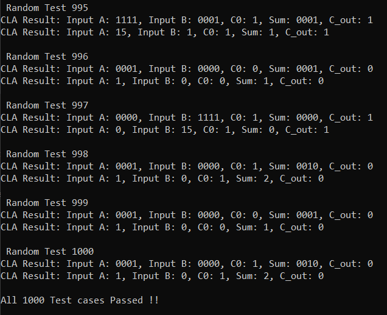

# Carry Look Ahead Adder

This projects designs a 4-bit Carry Look Ahead Adder and its testbench, the testbench uses randomized stimulus generation, functional equivalence checking and immediate assertion to verify the functionality of the design.


## Description

### DUT: Carry Look Ahead Adder

The Carry Lookahead Adder (CLA) is a fast adder architecture designed to overcome the carry propagation delay limitations of simpler adders like the Ripple Carry Adder (RCA). It achieves speed improvement by calculating carry bits in parallel rather than sequentially rippling through each bit position. CLAs are widely used in processors where speed is a critical factor. CLA is based on the concepts of generate (G) and propagate (P) signals for each bit position.

<br>

### Working 

The design consists of a 4 bit CLA, the parallel computation of the generate (G) and propagate (P) is shown here for better understanding:

```
we know that the SUM bit and carry out (C_OUT) bit of a Full Adder with 
three input bits A, B an carry in (C_IN) can be written as:

SUM   =  A ^ B ^ C_IN
C_OUT =  (A & B) | (C_IN & (A ^ B))

Now, A & B = G and A ^ B = P

so, C_OUT = G | C_IN & P 

```

Now, using this substitution all values of the carry ins to all the bits are calculated in parallel before the actual addition takes place:

C<sub>1</sub> = G<sub>0</sub> + P<sub>0</sub>C<sub>0</sub>
C<sub>2</sub> = G<sub>1</sub> + P<sub>1</sub>G<sub>0</sub> + P<sub>1</sub>P<sub>0</sub>C<sub>0</sub>
C<sub>3</sub> = G<sub>2</sub> + P<sub>2</sub>G<sub>1</sub> + P<sub>2</sub>P<sub>1</sub>G<sub>0</sub> + P<sub>2</sub>P<sub>1</sub>P<sub>0</sub>C<sub>0</sub> ... and so on.

So the addition takes place in 3 steps:
1. Calculate all Generate and Propagate Bits
2. Calculate all Carry_in bits in parallel
3. Calculate all the sum bits in parallel

#### Advantages:

    - Significantly faster than Ripple Carry Adder (RCA): Reduces carry propagation delay from linear to logarithmic with respect to bit width, especially for larger adders.
    - Good performance for moderate bit widths: Offers a favorable balance between speed and complexity for typical processor word sizes (32-bit, 64-bit).
    - Improved speed compared to Carry Skip Adder (CSKA) in some cases: Provides more predictable performance improvement than CSKA.

#### Disadvantages:

    - More complex than RCA: Requires additional logic for generating and propagating carry signals, leading to a more complex circuit.
    - Larger area compared to RCA: Increased logic complexity translates to a larger silicon area footprint.
    - Higher power consumption than RCA: More gates and increased switching activity can lead to higher power dissipation.
    - Complexity increases1 with bit width: While2 more scalable than RCA, the carry lookahead logic does become more intricate as the adder width grows, although not as drastically as prefix adders.   


### Testbench
The testbench used for verifying is a standard SV testbench with randomized stimulus generation, functional equivalence checking and immediate assertion.

## Project Organization

This project is organized as follows:

* **build/:** Contains compiled output files.
* **figures/:** Stores generated figures or images.
* **rtl/:** Holds the Register Transfer Level (RTL) Verilog source code files for the CMOS gates.
    * **cla.v:** Verilog module for a 4-bit Carry Look Ahead Adder.
    * **testbench.sv:** SystemVerilog testbench for verifying the functionality of the designs.
    * **timescale.v:** Verilog file defining the timescale used for simulation.

* **waves/:** Stores waveform data files.
* **Makefile:** File used to automate the build and simulation process.
* **Readme.md:** Documentation file.


## Tools Used

1. Icarus Verilog
    Icarus Verilog (often shortened to Icarus) is a popular, open-source, command-line based Verilog simulator. It's a crucial tool in the world of digital hardware design and verification, especially within open-source and educational settings.
    - Compiles your Verilog code to create an internal representation of your design.
    - Simulates the design using an event-driven engine, processing events (signal changes) in time order.
    - Propagates value changes through the circuit's interconnections.
    - Executes procedural blocks and system tasks.
    - Allows external tools like Cocotb to interact with the simulation through interfaces, enabling powerful verification capabilities.

4. GTKWave
    GTKWave is a powerful waveform viewer used extensively in digital design and electronic design automation (EDA). It's primarily used to visualize signal waveforms generated during simulations of digital circuits and systems described in Hardware Description Languages (HDLs) like Verilog and VHDL.

    - Waveform Viewer: GTKWave's primary purpose is to display and analyze signal waveforms. These waveforms represent how signal values (logic levels, analog voltages, etc.) change over time during a simulation.
    - Post-Simulation Analysis Tool: GTKWave is a post-simulation tool. This means it doesn't perform the simulation itself. Instead, it reads waveform data that has been generated by an HDL simulator (like Icarus Verilog, ModelSim, Vivado Simulator, etc.) after a simulation run is complete.
    - Open Source and Free: GTKWave is open-source software, licensed under the GNU Lesser General Public License (LGPL). This makes it freely available to use and distribute, a significant advantage for many users, especially in open-source and educational environments.
    - Cross-Platform: GTKWave is designed to be cross-platform and runs on various operating systems, including Linux, macOS, and Windows. This portability is essential for users working on different development platforms.
    - Graphical User Interface (GUI): GTKWave has a graphical user interface, allowing users to interact with waveforms visually.


## Build Process

```bash
make all     # Performs the entire process (compilation, simulation, and waveform viewing)
make compile # Compiles the design files into a simulation executable
make sim     # Runs the simulation and generates waveform data
make wave    # Opens the waveform viewer to visualize simulation results
make clean   # Removes all generated files and directories
```

## Output

The testbench output is shown below:

<p>
    
    <figcaption>Testbench Output</figcaption>
</p>


The waveforms of all the design can be observed here:

<p>
    
    <figcaption>Waveforms from all the designs generated by the Testbench</figcaption>
</p>


## License

This project is licensed under the GNU General Public License, Version 3 - see the [LICENSE.md](LICENSE.md) file for details.

## Contact

- Author: Ujval Madhu
- Email: ujvalmadhu003@gmail.com

## Acknowledgments

- Prof. Shaik Rafi Ahamed, IIT Guwahati