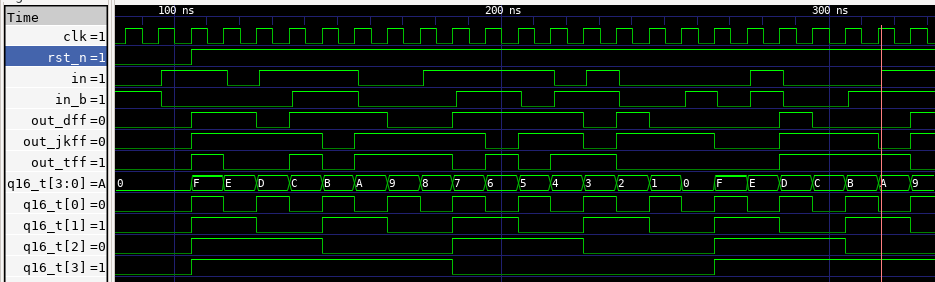

# Sequential Modeling of Counters

This projects models various types of counters using sequential logic.

## Project Index

| Sl No | Project | Description |
|-------|---------|-------------|
| 1.    | 4-bit Ripple Counter |  Sequential Modeling of a 4-bit ripple/ mod-16 asynchronous counter |
| 2. |  |  |
| 3. |  | |


## Description

### Synchronous and Asynchronous Counters

Asynchronous counters are where the clock is not applied to all the flip flops, Synchronous designs involve more complex circuitry and the clock is applied to all flip flops in the counter.

Where Speed is preferred we use synchronous counters and where area or power is important we can use asynchronous counters

#### Synchronous and Asynchronous Resets:

The fundamental problem with synchronous reset in cascaded designs is timing:

With synchronous reset, flip-flops only reset on a clock edge
In a cascaded design, later stages are clocked by the outputs of earlier stages
During initial power-up (or simulation start), if those earlier stages are in an X state, they can't provide a valid clock to later stages

This creates a chicken-and-egg problem:

Later stages need valid clocks from earlier stages to respond to the reset
But earlier stages need to be reset first to provide valid clocks

Asynchronous reset solves this by breaking the dependency chain:

All flip-flops immediately reset regardless of clock state
This ensures all stages have known values before any clocking begins

This is why for counters and other cascaded sequential designs, asynchronous reset is generally preferred. It guarantees all flip-flops reach a known state, preventing X propagation through the design.


<p>
    
    <figcaption>Mod 16 Counter using T Flip FLops</figcaption>
</p>


## Project Organization

This project is organized as follows:

* **build/:** Contains compiled output files.
* **figures/:** Stores generated figures or images.
* **rtl/:** Holds the Register Transfer Level (RTL) Verilog source code files for the CMOS gates.
    * **dff.v:** Verilog module for a D Flip Flop.
    * **xor.v:** Verilog module for an XOR gate.
    * **tff.v:** Verilog module for a T Flip Flop.
    * **jkff.v:** Verilog module for a JK Flip Flop.
    * **mod16_T.v:** Verilog module for a mod 16 Asynchronous counter.
    * **testbench.sv:** SystemVerilog testbench for verifying the functionality of the designs.
    * **timescale.v:** Verilog file defining the timescale used for simulation.

* **waves/:** Stores waveform data files.
* **Makefile:** File used to automate the build and simulation process.
* **Readme.md:** Documentation file.


## Tools Used

1. Icarus Verilog
    Icarus Verilog (often shortened to Icarus) is a popular, open-source, command-line based Verilog simulator. It's a crucial tool in the world of digital hardware design and verification, especially within open-source and educational settings.
    - Compiles your Verilog code to create an internal representation of your design.
    - Simulates the design using an event-driven engine, processing events (signal changes) in time order.
    - Propagates value changes through the circuit's interconnections.
    - Executes procedural blocks and system tasks.
    - Allows external tools like Cocotb to interact with the simulation through interfaces, enabling powerful verification capabilities.

4. GTKWave
    GTKWave is a powerful waveform viewer used extensively in digital design and electronic design automation (EDA). It's primarily used to visualize signal waveforms generated during simulations of digital circuits and systems described in Hardware Description Languages (HDLs) like Verilog and VHDL.

    - Waveform Viewer: GTKWave's primary purpose is to display and analyze signal waveforms. These waveforms represent how signal values (logic levels, analog voltages, etc.) change over time during a simulation.
    - Post-Simulation Analysis Tool: GTKWave is a post-simulation tool. This means it doesn't perform the simulation itself. Instead, it reads waveform data that has been generated by an HDL simulator (like Icarus Verilog, ModelSim, Vivado Simulator, etc.) after a simulation run is complete.
    - Open Source and Free: GTKWave is open-source software, licensed under the GNU Lesser General Public License (LGPL). This makes it freely available to use and distribute, a significant advantage for many users, especially in open-source and educational environments.
    - Cross-Platform: GTKWave is designed to be cross-platform and runs on various operating systems, including Linux, macOS, and Windows. This portability is essential for users working on different development platforms.
    - Graphical User Interface (GUI): GTKWave has a graphical user interface, allowing users to interact with waveforms visually.


## Build Process

```bash
make all     # Performs the entire process (compilation, simulation, and waveform viewing)
make compile # Compiles the design files into a simulation executable
make sim     # Runs the simulation and generates waveform data
make wave    # Opens the waveform viewer to visualize simulation results
make clean   # Removes all generated files and directories
```

## Output:


The Waveforms from the simulation is shown here:
<p>
    
    <figcaption>Simulation Waveforms</figcaption>
</p>

## License

This project is licensed under the GNU General Public License, Version 3 - see the [LICENSE.md](LICENSE.md) file for details.

## Contact

- Author: Ujval Madhu
- Email: ujvalmadhu003@gmail.com

## Acknowledgments

- Prof. Shaik Rafi Ahamed, IIT Guwahati