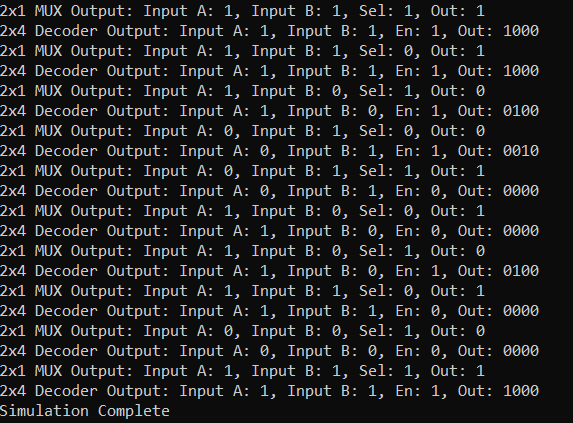

# Data Flow Modeling

This projects develops a 2x1 MUX and a 2x4 Decoder using Data Flow Modeling 
<br>
Data flow modeling in RTL (Register-Transfer Level) design is a style of describing digital hardware using a declarative approach that focuses on how data flows through the system and the operations performed on that data, rather than explicitly describing the sequential steps or structural implementation details.
<br>

### Key Characteristics of Data Flow Modeling:

- Declarative: You declare relationships and data transformations using continuous assignments (assign statements in Verilog) and expressions. You are essentially saying "this signal is always equal to this expression," rather than writing procedural code that executes in steps.

- Concurrent Operations: Data flow descriptions inherently imply concurrency.  All assign statements in a module are evaluated and updated concurrently whenever any of their input signals change. This reflects the parallel nature of hardware.

- Emphasis on Data Transformations: Data flow modeling is well-suited for describing combinational logic, where outputs are directly derived from inputs through a series of operations (like arithmetic, logical, bitwise operations). It's about describing the flow of data and how it's manipulated as it moves from inputs to outputs.

- Abstraction from Gate-Level Structure: Data flow descriptions are generally at a higher level of abstraction than structural modeling (gate-level). You don't explicitly instantiate individual logic gates (AND, OR, NOT, etc.). Instead, you use operators and expressions that are then implicitly translated into gate-level implementations by synthesis tools.


## Project Index

| Sl No | Project | Description |
|-------|---------|-------------|
| 1.    | 2x1 MUX | A 2x1 Multiplexer using Data Flow Modeling |
| 2.    | 2x4 Decoder | A 2x4 Decoder using Data Flow Modeling |


## Project Organization

This project is organized as follows:

* **build/:** Contains compiled output files.
* **figures/:** Stores generated figures or images.
* **rtl/:** Holds the Register Transfer Level (RTL) Verilog source code files for the CMOS gates.
    * **mux_2x1.v:** Verilog module for 2x1 MUX.
    * **decoder2x4.v:** Verilog module for 2x4 Decoder.
    * **testbench.sv:** SystemVerilog testbench for verifying the functionality of the designs.
    * **timescale.v:** Verilog file defining the timescale used for simulation.

* **waves/:** Stores waveform data files.
* **Makefile:** File used to automate the build and simulation process.
* **Readme.md:** Documentation file.


## Tools Used

1. Icarus Verilog
    Icarus Verilog (often shortened to Icarus) is a popular, open-source, command-line based Verilog simulator. It's a crucial tool in the world of digital hardware design and verification, especially within open-source and educational settings.
    - Compiles your Verilog code to create an internal representation of your design.
    - Simulates the design using an event-driven engine, processing events (signal changes) in time order.
    - Propagates value changes through the circuit's interconnections.
    - Executes procedural blocks and system tasks.
    - Allows external tools like Cocotb to interact with the simulation through interfaces, enabling powerful verification capabilities.

4. GTKWave
    GTKWave is a powerful waveform viewer used extensively in digital design and electronic design automation (EDA). It's primarily used to visualize signal waveforms generated during simulations of digital circuits and systems described in Hardware Description Languages (HDLs) like Verilog and VHDL.

    - Waveform Viewer: GTKWave's primary purpose is to display and analyze signal waveforms. These waveforms represent how signal values (logic levels, analog voltages, etc.) change over time during a simulation.
    - Post-Simulation Analysis Tool: GTKWave is a post-simulation tool. This means it doesn't perform the simulation itself. Instead, it reads waveform data that has been generated by an HDL simulator (like Icarus Verilog, ModelSim, Vivado Simulator, etc.) after a simulation run is complete.
    - Open Source and Free: GTKWave is open-source software, licensed under the GNU Lesser General Public License (LGPL). This makes it freely available to use and distribute, a significant advantage for many users, especially in open-source and educational environments.
    - Cross-Platform: GTKWave is designed to be cross-platform and runs on various operating systems, including Linux, macOS, and Windows. This portability is essential for users working on different development platforms.
    - Graphical User Interface (GUI): GTKWave has a graphical user interface, allowing users to interact with waveforms visually.


## Build Process

```bash
make all     # Performs the entire process (compilation, simulation, and waveform viewing)
make compile # Compiles the design files into a simulation executable
make sim     # Runs the simulation and generates waveform data
make wave    # Opens the waveform viewer to visualize simulation results
make clean   # Removes all generated files and directories
```

## Output

The testbench output is shown below:

<p>
    
    <figcaption>Testbench Output</figcaption>
</p>


The waveforms of all the design can be observed here:

<p>
    
    <figcaption>Waveforms from all the designs, generated by the Testbench</figcaption>
</p>


## License

This project is licensed under the GNU General Public License, Version 3 - see the [LICENSE.md](LICENSE.md) file for details.

## Contact

- Author: Ujval Madhu
- Email: ujvalmadhu003@gmail.com

## Acknowledgments

- Prof. Shaik Rafi Ahamed, IIT Guwahati