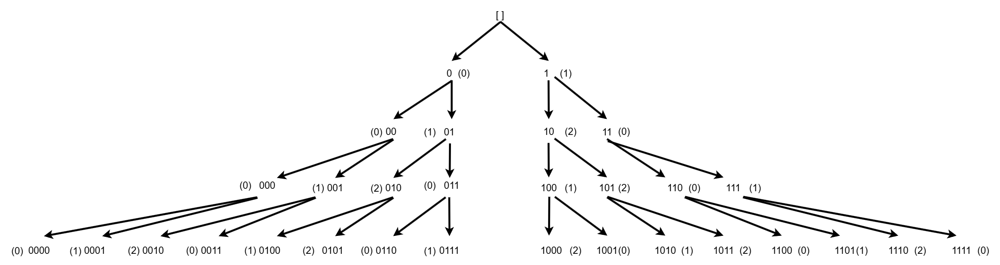
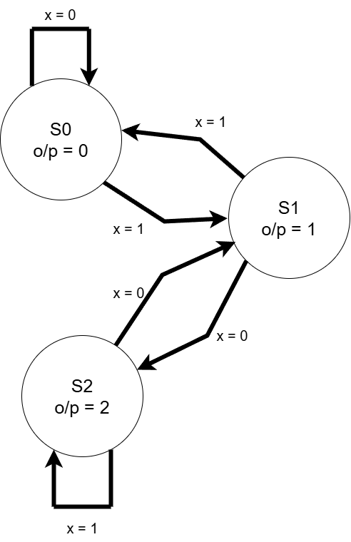
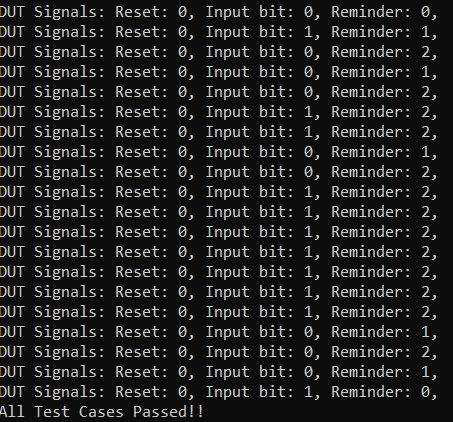
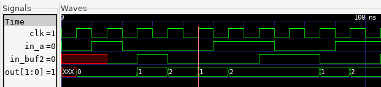

# RTL design for checking the divisibility of an input stream by 3.

This project has two designs:
1. An FSM in SystemVerilog that will essentially generate the reminder for an MSB first input stream when divided by 3.
2. A more simpler Verilog implementation using 5 muxes that can effectively do the same function.


## Modeling the Design

To design the state machine , we first try to find a pattern in the generation of remainder when a random serial stream is inputted to the DUT MSB first.

The possible outcomes of input stream and their corresponding reminder (shown inside bracket) can be visualized as Shown:

<p>
    
    <figcaption>Possible reminder outcomes when dividing an input stream by 3</figcaption>
</p>


From the above diagram we see that a current input bit can only have 2 possible outcomes, and based on reminder generated by this bit, the next bit reminder can be estimated based on the following pattern that will be specific to diving by 3:

For current bit's reminder = 0:
- if next bit is 1, next reminder 1
- if next bit is 0, next reminder 0

For current bit's reminder = 1:
- if next bit is 1, next reminder 0
- if next bit is 0, next reminder 2

For current bit's reminder = 2:
- if next bit is 1, next reminder 2
- if next bit is 0, next reminder 1


Based on this logic a state machine can be created as follows:

<p>
    
    <figcaption>State Machine For the Design</figcaption>
</p>


The above logic can also be implemented more using muxes without the need for an FSM. This is shown in the ```div_by_3.v``` verilog file. The implementation can be understood using the above explanation, but I thought about the problem using a different approach: It can be noticed that the reminder when dividing by 3 can only be 0, 1 or 2. And if we add a new bit to the LSB it can have the two possible effects on the reminder: 
1. If 0 is added to the LSB the original number becomes its double
2. If 1 is added then the original number transforms into its double + 1.

We only check the conditions were the reminder becomes 1 or 2 and know that all other cases the reminder will be 0.

## Project Organization

This project is organized as follows:

* **build/:** Contains compiled output files.
* **figures/:** Stores generated figures or images.
* **rtl/:** Holds the Register Transfer Level (RTL) Verilog source code files for the CMOS gates.
    * **div_by_3.sv:** System Verilog module for of the FSM.
    * **div_by_3.v:**  A more simpler implementation without a state machine and using only 5 muxes.
    * **testbench.sv:** SystemVerilog testbench for verifying the functionality of the designs.
    * **timescale.v:** Verilog file defining the timescale used for simulation.

* **waves/:** Stores waveform data files.
* **Makefile:** File used to automate the build and simulation process.
* **Readme.md:** Documentation file.


## Tools Used

1. Icarus Verilog
    Icarus Verilog (often shortened to Icarus) is a popular, open-source, command-line based Verilog simulator. It's a crucial tool in the world of digital hardware design and verification, especially within open-source and educational settings.
    - Compiles your Verilog code to create an internal representation of your design.
    - Simulates the design using an event-driven engine, processing events (signal changes) in time order.
    - Propagates value changes through the circuit's interconnections.
    - Executes procedural blocks and system tasks.
    - Allows external tools like Cocotb to interact with the simulation through interfaces, enabling powerful verification capabilities.

4. GTKWave
    GTKWave is a powerful waveform viewer used extensively in digital design and electronic design automation (EDA). It's primarily used to visualize signal waveforms generated during simulations of digital circuits and systems described in Hardware Description Languages (HDLs) like Verilog and VHDL.

    - Waveform Viewer: GTKWave's primary purpose is to display and analyze signal waveforms. These waveforms represent how signal values (logic levels, analog voltages, etc.) change over time during a simulation.
    - Post-Simulation Analysis Tool: GTKWave is a post-simulation tool. This means it doesn't perform the simulation itself. Instead, it reads waveform data that has been generated by an HDL simulator (like Icarus Verilog, ModelSim, Vivado Simulator, etc.) after a simulation run is complete.
    - Open Source and Free: GTKWave is open-source software, licensed under the GNU Lesser General Public License (LGPL). This makes it freely available to use and distribute, a significant advantage for many users, especially in open-source and educational environments.
    - Cross-Platform: GTKWave is designed to be cross-platform and runs on various operating systems, including Linux, macOS, and Windows. This portability is essential for users working on different development platforms.
    - Graphical User Interface (GUI): GTKWave has a graphical user interface, allowing users to interact with waveforms visually.


## Build Process

```bash
make all     # Performs the entire process (compilation, simulation, and waveform viewing)
make compile # Compiles the design files into a simulation executable
make sim     # Runs the simulation and generates waveform data
make wave    # Opens the waveform viewer to visualize simulation results
make clean   # Removes all generated files and directories
```

## Output:

The Output from the simulation is shown here:
<p>
    
    <figcaption>Test Bench output</figcaption>
</p>

The Waveforms from the simulation is shown here:
<p>
    
    <figcaption>Simulation Waveforms</figcaption>
</p>

## License

This project is licensed under the GNU General Public License, Version 3 - see the [LICENSE.md](LICENSE.md) file for details.

## Contact

- Author: Ujval Madhu
- Email: ujvalmadhu003@gmail.com

## Acknowledgments

- Kevin Mitchell, Verification Engineer, Apple