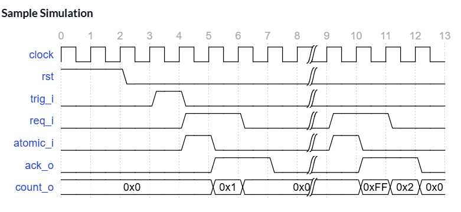
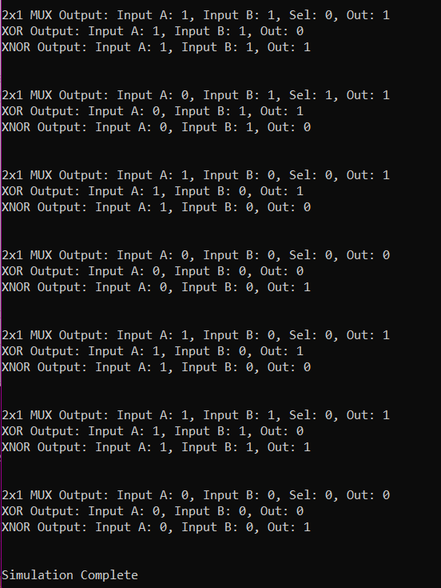

# Atomic Counter and Bus Read

This projects is part of the wonderful course, [Hands-in RTL](https://quicksilicon.in/course/rtl-design) created by Rahul Behl. Highly recommended if you are an aspiring RTL Designer or Verification Engineer. The website offers hands on practice, visualization, in depth video explanation and the most efficient solutions in Verilog, VHDL and SystemVerilog. The solution implemented here is my first try on the problem and is not the most efficient, I've implemented a better solution based on the reference from the course but cannot share that due to copyright concerns from the course.

## Problem:

Design a 64-bit event counter module and its 32-bit bus interface for a micro-controller. The counter increments on a trigger input. Implement a mechanism to ensure 64-bit reads, which require two 32-bit bus cycles, are single-copy atomic. Use positive edge-triggered flops with asynchronous resets if needed.

### Atomic Operation:

An atomic operation is an operation that is guaranteed to complete in its entirety without being interrupted by other operations. From the perspective of other processes or threads, an atomic operation either happens completely or doesn't happen at all; there's no in-between state where only part of the operation has occurred. Think of it like a single, indivisible action.

Common examples of operations that need to be atomic in multi-threaded or multi-processor systems include:

- Read-Modify-Write cycles: Reading a value, performing an operation on it, and writing it back (e.g., incrementing a counter). If not atomic, another process could read the old value after the first process reads it but before it writes the new value, leading to a lost update.   
- Swapping values: Exchanging the contents of two memory locations.   
- Test-and-set: Reading a value and setting it to a new value based on the original value.


### Interface Definition

```
trig_i    : Trigger input to increment the counter (High level on clock edge is an indication for incrementing)
req_i     : A read request to the counter
atomic_i  : Marks whether the current request is the first part of the two 32-bit accesses to read
            the 64-bit counter. Use this input to save the current value of the upper 32-bit of
            the counter in-order to ensure single-copy atomic operation
ack_o     : Acknowledge output from the counter
count_o   : 32-bit counter value given as output to the controller

```

**Interface Requirements**

The counter value is read by a 32-bit wide bus but the output should be single-copy atomic. The interface is a simple request and acknowledge interface with the following strict requirements:

Request can be a pulse or can get back to back multiple requests
The acknowledge output must be given one cycle after the request is asserted
The count_o signal must be 0 when the ack_o signal is not asserted
The controller will always send two requests in order to read the full 64-bit counter
The first request will always have the atomic_i input asserted
The second request will not have the atomic_i input asserted

The Counter should have an output response as shown here:

<p>
    
    <figcaption>                Sample Waveform                </figcaption>
</p>


## Project RTL Directory

| Sl No | Project | Description |
|-------|---------|-------------|
| 1.    | atm_counter.v | Implementation of the Atomic Counter in Verilog |
| 2. | atm_counter.vhd | Implementation of teh atomic counter in VHDL |
| 3. | testbench.sv | System Verilog testbench for the module |


CMOS Transmission gate Circuit is shown here:
<p>
    
    <figcaption>CMOS Transmission Gate</figcaption>
</p>

#### NMOS and PMOS Transistors as Switches (Simple Switches)

You can also use a single NMOS transistor or a single PMOS transistor as a switch, but they introduce some inefficiencies.

NMOS Switch:

Use the NMOS transistor with its drain and source as the switch terminals and the gate as the control.
Turns ON when Gate is HIGH: Conducts when the gate voltage is high relative to the source.
Good at Passing Logic '0': NMOS transistors are excellent at pulling a node down to ground (logic '0'). They pass logic '0' very well with low resistance.
Poor at Passing Logic '1': NMOS transistors are not good at passing logic '1' fully. Due to the threshold voltage (Vt) drop, the output voltage will be approximately VDD - Vt when trying to pass a '1'. This voltage may not be recognized as a full logic '1' by subsequent gates, especially in cascaded stages. This is called threshold voltage drop or level degradation for logic '1'.
Unidirectional (Primarily): While nominally bidirectional in terms of current flow when ON, the control action is gate-to-channel, and source/drain are typically defined.
PMOS Switch:

Use the PMOS transistor with its drain and source as the switch terminals and the gate as the control.
Turns ON when Gate is LOW: Conducts when the gate voltage is low relative to the source.
Good at Passing Logic '1': PMOS transistors are excellent at pulling a node up to VDD (logic '1'). They pass logic '1' very well with low resistance.
Poor at Passing Logic '0': PMOS transistors are not good at passing logic '0' fully. Due to the threshold voltage drop, the output voltage will be approximately Vt (above ground) when trying to pass a '0'. This voltage may not be recognized as a full logic '0'. This is threshold voltage drop or level degradation for logic '0'.
Unidirectional (Primarily): Similar to NMOS, control is gate-to-channel.

### 2:1 MUX Design using Transmission Gates

A 2:1 multiplexer selects one of two input signals based on a select signal. It can be implemented using two transmission gates and an inverter.

Transmission Gate 1: Input in_1, Output out, Control signal SEL (and /SEL for the PMOS).
Transmission Gate 2: Input in_2, Output out, Control signal /SEL (and SEL for the PMOS).

Circuit Description:

- When the select signal SEL is LOW:
Transmission Gate 1 is ON (passes in_1 to out).
Transmission Gate 2 is OFF.
Output out = in_1.

- When the select signal SEL is HIGH:
Transmission Gate 1 is OFF.
Transmission Gate 2 is ON (passes in_2 to out).
Output out = in_2.

2:1 MUX using Transmission Gates is shown here:
<p>
    
    <figcaption>2:1 MUX using Transmission Gate</figcaption>
</p>

### XOR and XNOR gates using Transmission Gates

Both XNOR and XOR gates can be efficiently implemented using transmission gates. In fact, transmission gate implementations often require fewer transistors compared to implementations using standard static CMOS logic gates (like NAND, NOR, etc.).

### Advantages and Disadvantages of Transmission Gate Designs:

#### Advantages:

- Lower Transistor Count for Certain Functions: For specific logic functions like XOR, XNOR, and multiplexers, transmission gate implementations often require fewer transistors compared to their counterparts using standard static CMOS logic gates (NAND, NOR, etc.). This can lead to smaller chip area and potentially lower manufacturing costs.
- Good Signal Swing: Transmission gates can pass both strong logic '0' (close to ground) and strong logic '1' (close to VDD) signals with minimal voltage drop across the switch when they are ON. This is because the NMOS transistor efficiently passes '0's, and the PMOS transistor efficiently passes '1's, and they work in parallel.
- Bidirectional Capability: Transmission gates are inherently bidirectional, meaning they can pass signals in either direction between their input and output terminals. This is particularly useful in multiplexers, switches, and memory architectures.
- Potential for Faster Operation: In some cases, circuits designed with transmission gates can achieve higher speeds due to fewer stacked transistors in the signal path compared to complex static CMOS gates. This can reduce delays.
- Layout Efficiency: For certain circuit structures, using transmission gates can lead to more compact and efficient layouts, reducing the overall area of the integrated circuit.

#### Disadvantages:

- Static Power Consumption (Potential): If the input voltage to a transmission gate is at an intermediate level (between VDD and GND) while the gate is ON, it can create a direct path between VDD and GND through both the NMOS and PMOS transistors for a brief period, leading to static power dissipation. This is more of a concern in complex networks or if input signals have slow rise/fall times.
- Control Signal Requirements: Transmission gates require both the true and complementary forms of the control signal to operate effectively (one for the NMOS gate and the other for the PMOS gate). Generating the complementary signal often requires an additional inverter, which adds to the transistor count and power consumption of the overall system, although the local advantage might still hold.
- Noise Margins: The noise margins in transmission gate-based logic might be smaller compared to fully restored CMOS logic, making them potentially more susceptible to noise.
- Output Driving Capability: The output driving capability of a transmission gate might be weaker compared to a CMOS inverter or other active drivers, especially when driving large capacitive loads. Buffers might be needed at the output to improve the driving strength.

## Project Organization

This project is organized as follows:

* **build/:** Contains compiled output files.
* **figures/:** Stores generated figures or images.
* **rtl/:** Holds the Register Transfer Level (RTL) Verilog source code files for the CMOS gates.
    * **mux_2x1.v:** Verilog module for a 2x1 MUX.
    * **inverter.v:** Verilog module for an inverter gate.
    * **testbench.sv:** SystemVerilog testbench for verifying the functionality of the designs.
    * **timescale.v:** Verilog file defining the timescale used for simulation.

* **waves/:** Stores waveform data files.
* **Makefile:** File used to automate the build and simulation process.
* **Readme.md:** Documentation file.


## Tools Used

1. Icarus Verilog
    Icarus Verilog (often shortened to Icarus) is a popular, open-source, command-line based Verilog simulator. It's a crucial tool in the world of digital hardware design and verification, especially within open-source and educational settings.
    - Compiles your Verilog code to create an internal representation of your design.
    - Simulates the design using an event-driven engine, processing events (signal changes) in time order.
    - Propagates value changes through the circuit's interconnections.
    - Executes procedural blocks and system tasks.
    - Allows external tools like Cocotb to interact with the simulation through interfaces, enabling powerful verification capabilities.

4. GTKWave
    GTKWave is a powerful waveform viewer used extensively in digital design and electronic design automation (EDA). It's primarily used to visualize signal waveforms generated during simulations of digital circuits and systems described in Hardware Description Languages (HDLs) like Verilog and VHDL.

    - Waveform Viewer: GTKWave's primary purpose is to display and analyze signal waveforms. These waveforms represent how signal values (logic levels, analog voltages, etc.) change over time during a simulation.
    - Post-Simulation Analysis Tool: GTKWave is a post-simulation tool. This means it doesn't perform the simulation itself. Instead, it reads waveform data that has been generated by an HDL simulator (like Icarus Verilog, ModelSim, Vivado Simulator, etc.) after a simulation run is complete.
    - Open Source and Free: GTKWave is open-source software, licensed under the GNU Lesser General Public License (LGPL). This makes it freely available to use and distribute, a significant advantage for many users, especially in open-source and educational environments.
    - Cross-Platform: GTKWave is designed to be cross-platform and runs on various operating systems, including Linux, macOS, and Windows. This portability is essential for users working on different development platforms.
    - Graphical User Interface (GUI): GTKWave has a graphical user interface, allowing users to interact with waveforms visually.


## Build Process

```bash
make all     # Performs the entire process (compilation, simulation, and waveform viewing)
make compile # Compiles the design files into a simulation executable
make sim     # Runs the simulation and generates waveform data
make wave    # Opens the waveform viewer to visualize simulation results
make clean   # Removes all generated files and directories
```

## Output:

The Output from the simulation is shown here:
<p>
    
    <figcaption>Test Bench output</figcaption>
</p>

The Waveforms from the simulation is shown here:
<p>
    
    <figcaption>Simulation Waveforms</figcaption>
</p>

## License

This project is licensed under the GNU General Public License, Version 3 - see the [LICENSE.md](LICENSE.md) file for details.

## Contact

- Author: Ujval Madhu
- Email: ujvalmadhu003@gmail.com

## Acknowledgments

- Prof. Shaik Rafi Ahamed, IIT Guwahati