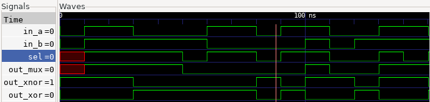

# Events to APB
This projects is part of the course, [Hands on RTL](https://quicksilicon.in/course/rtl-design) created by Rahul Behl. Highly recommended if you are an aspiring RTL Designer or Verification Engineer. The website offers hands on practice, visualization, in depth video explanation and the efficient solutions in Verilog, VHDL and SystemVerilog. The solution implemented here is my first try on the problem and may not be the most efficient, I've implemented a better solution based on the reference from the course but cannot share that due to copyright concerns from the course.

## Problem:

Design a module that can convert three different types of input events into APB transactions. Whenever a particular input event is asserted, an APB transaction needs to be sent to an associated peripheral address.

### Interface Definition
The block takes three single bit inputs:
```
event_a_i
event_b_i
event_c_i
```
The output APB transaction uses the following signals:

```
apb_psel_o
apb_penable_o
apb_paddr_o[31:0]
apb_pwrite_o
apb_pwdata_o[31:0]
apb_pready_i

```

**Interface Requirements**

Output must be given every cycle
Input will be a stream of bits presented to the circuit on every cycle

The Counter should have an output response as shown here:

<p>
    
    <figcaption>                Sample Waveform                </figcaption>
</p>


## Project RTL Directory

| Sl No | Project | Description |
|-------|---------|-------------|
| 1.    | 3bit_palindrome.v | Implementation of the 3 Bit Palindrome checker in Verilog |
| 2. | 3bit_palindrome.vhd |  Implementation of the 3 Bit Palindrome checkerin VHDL |
| 3. | testbench.sv | System Verilog testbench for the module |


## Project Organization

This project is organized as follows:

* **build/:** Contains compiled output files.
* **figures/:** Stores generated figures or images.
* **rtl/:** Holds the Register Transfer Level (RTL) source code files for the design.
    * **3bit_palindrome.v:** Implementation of the Atomic Counter in Verilog.
    * **3bit_palindrome.vhd:** Implementation of teh atomic counter in VHDL.
    * **testbench.sv:** SystemVerilog testbench for verifying the functionality of the designs.
    * **timescale.v:** Verilog file defining the timescale used for simulation.

* **waves/:** Stores waveform data files.
* **Makefile:** File used to automate the build and simulation process.
* **Readme.md:** Documentation file.


## Tools Used

1. Icarus Verilog
    Icarus Verilog (often shortened to Icarus) is a popular, open-source, command-line based Verilog simulator. It's a crucial tool in the world of digital hardware design and verification, especially within open-source and educational settings.
    - Compiles your Verilog code to create an internal representation of your design.
    - Simulates the design using an event-driven engine, processing events (signal changes) in time order.
    - Propagates value changes through the circuit's interconnections.
    - Executes procedural blocks and system tasks.
    - Allows external tools like Cocotb to interact with the simulation through interfaces, enabling powerful verification capabilities.

4. GTKWave
    GTKWave is a powerful waveform viewer used extensively in digital design and electronic design automation (EDA). It's primarily used to visualize signal waveforms generated during simulations of digital circuits and systems described in Hardware Description Languages (HDLs) like Verilog and VHDL.

    - Waveform Viewer: GTKWave's primary purpose is to display and analyze signal waveforms. These waveforms represent how signal values (logic levels, analog voltages, etc.) change over time during a simulation.
    - Post-Simulation Analysis Tool: GTKWave is a post-simulation tool. This means it doesn't perform the simulation itself. Instead, it reads waveform data that has been generated by an HDL simulator (like Icarus Verilog, ModelSim, Vivado Simulator, etc.) after a simulation run is complete.
    - Open Source and Free: GTKWave is open-source software, licensed under the GNU Lesser General Public License (LGPL). This makes it freely available to use and distribute, a significant advantage for many users, especially in open-source and educational environments.
    - Cross-Platform: GTKWave is designed to be cross-platform and runs on various operating systems, including Linux, macOS, and Windows. This portability is essential for users working on different development platforms.
    - Graphical User Interface (GUI): GTKWave has a graphical user interface, allowing users to interact with waveforms visually.


## Build Process

```bash
make all     # Performs the entire process (compilation, simulation, and waveform viewing)
make compile # Compiles the design files into a simulation executable
make sim     # Runs the simulation and generates waveform data
make wave    # Opens the waveform viewer to visualize simulation results
make clean   # Removes all generated files and directories
```

<!-- ## Output:

The Output from the simulation is shown here:
<p>
    
    <figcaption>Test Bench output</figcaption>
</p>

The Waveforms from the simulation is shown here:
<p>
    
    <figcaption>Simulation Waveforms</figcaption>
</p> -->

## License

This project is licensed under the GNU General Public License, Version 3 - see the [LICENSE.md](LICENSE.md) file for details.

## Contact

- Author: Ujval Madhu
- Email: ujvalmadhu003@gmail.com

## Acknowledgments

- Rahul Behl, [Hands on RTL](https://quicksilicon.in/course/rtl-design)