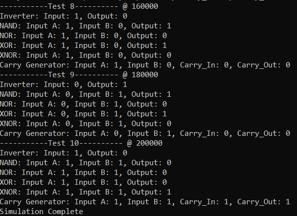

# Switch level Modelling of CMOS Gates and Boolean Logic

The projects models standard CMOS gates and boolean logic using Verilog HDL.
Although HDL usually works at a higher level of abstraction, like registers, dataflow and control, modelling transistor level designs have some advantages:
-  switch-level modeling represents circuits at the transistor level, which theoretically allows for more precise control and potentially more efficient implementations.
- Learning and Understanding of CMOS circuits
- Build custom digital circuits in rare cases, where standard cells may not be available
- Analyze and simulate designs at the transistor level for power and timing

However, this is not widely used due many reasons:
- With switch-level design, we're directly dealing with transistors, so Process technology variations have a more immediate impact on our circuit behavior. Gate-level abstractions, by comparison, provide standard cells that have already been characterized across these variations, making designs more robust.
- Transistor sizing can be an issue as standard verilog doesn't support it, but verilog-A or verilog-AMS can.
- Increased design and verification complexity
- Tool support is limited for switch level synthesis as most commercial EDA tools are optimized for gate-level synthesis, with comprehensive libraries and optimization algorithms.


## Project Index

| Sl No | Project | Description |
|-------|---------|-------------|
| 1.    | Inverter | Standard CMOS Inverter |
| 2.    | NAND GATE | Standard 2 input CMOS Nand Gate |
| 3.    | NOR GATE  | Standard 2 input CMOS NOR Gate |
| 4.    | XOR GATE | Standard 2 input CMOS XOR Gate |
| 5.    | XNOR GATE | Standard 2 input CMOS XNOR Gate |
| 6.    | Carry of a Full Adder | Switch level Implementation of the carry logic of Low Power Full Adder, much lower transistor count when compared with gate level implementation |


## Project Organization

This project is organized as follows:

* **build/:** Contains compiled output files.
* **figures/:** Stores generated figures or images.
* **rtl/:** Holds the Register Transfer Level (RTL) Verilog source code files for the CMOS gates.
    * **carry_FA.v:** Verilog module for a carry circuit, likely part of a Full Adder.
    * **inverter.v:** Verilog module for an inverter gate.
    * **nand.v:** Verilog module for a NAND gate.
    * **nor.v:** Verilog module for a NOR gate.
    * **testbench.sv:** SystemVerilog testbench for verifying the functionality of the gates.
    * **timescale.v:** Verilog file defining the timescale used for simulation.
    * **xnor.v:** Verilog module for an XNOR gate.
    * **xor.v:** Verilog module for an XOR gate.
* **waves/:** Stores waveform data files.
* **Makefile:** A file used to automate the build and simulation process.
* **Readme.md:** The project's documentation file.


## Tools Used

1. Icarus Verilog
    Icarus Verilog (often shortened to Icarus) is a popular, open-source, command-line based Verilog simulator. It's a crucial tool in the world of digital hardware design and verification, especially within open-source and educational settings.
    - Compiles your Verilog code to create an internal representation of your design.
    - Simulates the design using an event-driven engine, processing events (signal changes) in time order.
    - Propagates value changes through the circuit's interconnections.
    - Executes procedural blocks and system tasks.
    - Allows external tools like Cocotb to interact with the simulation through interfaces, enabling powerful verification capabilities.

4. GTKWave
    GTKWave is a powerful waveform viewer used extensively in digital design and electronic design automation (EDA). It's primarily used to visualize signal waveforms generated during simulations of digital circuits and systems described in Hardware Description Languages (HDLs) like Verilog and VHDL.

    - Waveform Viewer: GTKWave's primary purpose is to display and analyze signal waveforms. These waveforms represent how signal values (logic levels, analog voltages, etc.) change over time during a simulation.
    - Post-Simulation Analysis Tool: GTKWave is a post-simulation tool. This means it doesn't perform the simulation itself. Instead, it reads waveform data that has been generated by an HDL simulator (like Icarus Verilog, ModelSim, Vivado Simulator, etc.) after a simulation run is complete.
    - Open Source and Free: GTKWave is open-source software, licensed under the GNU Lesser General Public License (LGPL). This makes it freely available to use and distribute, a significant advantage for many users, especially in open-source and educational environments.
    - Cross-Platform: GTKWave is designed to be cross-platform and runs on various operating systems, including Linux, macOS, and Windows. This portability is essential for users working on different development platforms.
    - Graphical User Interface (GUI): GTKWave has a graphical user interface, allowing users to interact with waveforms visually.


## Build Process

```bash
make all     # Performs the entire process (compilation, simulation, and waveform viewing)
make compile # Compiles the design files into a simulation executable
make sim     # Runs the simulation and generates waveform data
make wave    # Opens the waveform viewer to visualize simulation results
make clean   # Removes all generated files and directories
```

## Documentation:

### Standard Gates
1. The Transistor Switch Level design of an inverter is shown here, the gate, source and drain of the PMOS and NMOS are indicated:
<p>
    
    <figcaption>CMOS Inverter</figcaption>
</p>

2. The Transistor Switch Level designs of NAND, NOR, XOR and XNOR are shown here:
<p>
    
    <figcaption>NAND, NOR, XOR and XNOR (Image ref: IIT Guwahati)</figcaption>
</p>

### Carry of a Low Power Full Adder
A switch level implementation of the Carry logic of Full Adder is done, we know that the logic of carry in a Full Adder with Inputs A, B and Carry in Cin can be written as:

$$ C_{out} = A \cdot B + B \cdot C_{in} + A \cdot C_{in} =\:\sim(\sim(A \cdot B + B \cdot C_{in} + A \cdot C_{in})) $$

Where:

* A and B are the input bits.
* Cin is the carry-in bit.
* Cout is the carry-out bit.

Now, for effective implementation with the least transistors, we can try to implement $\sim(A \cdot B + B \cdot C_{in} + A \cdot C_{in})$ and use a single not gate complement afterwards to obtain the result.

<p>
    
    <figcaption>Switch Level Design of Carry of a Full Adder</figcaption>
</p>

For a gate level implementation we would typically need 3 AND gates and 2 OR Gates so total cost = 5x6 = 30 transistors, but here we can see that we have only used 17 Transistors, roughly a 43% reduction. This would lead to significant benefits in speed, area and power metrics.

## Output

The testbench output is shown below:

<p>
    
    <figcaption>Testbench Output</figcaption>
</p>


The waveforms of all the design can be observed here:

<p>
    
    <figcaption>Waveforms from all the designs generated by the Testbench</figcaption>
</p>


## License

This project is licensed under the GNU General Public License, Version 3 - see the [LICENSE.md](LICENSE.md) file for details.

## Contact

- Author: Ujval Madhu
- Email: ujvalmadhu003@gmail.com

## Acknowledgments

- Prof. Shaik Rafi Ahamed, IIT Guwahati